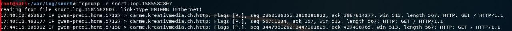
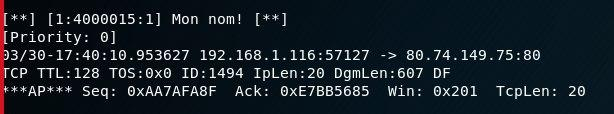
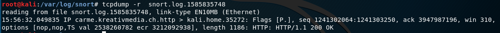
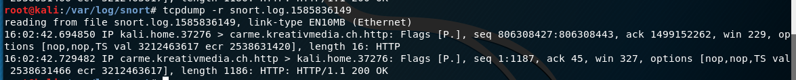

Auteurs : Gwendoline Dössegger & Gabriel Roch

---

# Teaching-HEIGVD-SRX-2020-Laboratoire-IDS

**Ce travail de laboratoire est à faire en équipes de 2 personnes** (oui... en remote...). Je vous laisse vous débrouiller ;-)

**ATTENTION : Commencez par créer un Fork de ce repo et travaillez sur votre fork.**

Clonez le repo sur votre machine. Vous pouvez répondre aux questions en modifiant directement votre clone du README.md ou avec un fichier pdf que vous pourrez uploader sur votre fork.

**Le rendu consiste simplement à répondre à toutes les questions clairement identifiées dans le text avec la mention "Question" et à les accompagner avec des captures. Le rendu doit se faire par une "pull request". Envoyer également le hash du dernier commit et votre username GitHub par email au professeur et à l'assistant**

## Table de matières

[Introduction](#introduction)

[Echéance](#echéance)

[Configuration du réseau](#configuration-du-réseau-sur-virtualbox)

[Installation de Snort](#installation-de-snort-sur-linux)

[Essayer Snort](#essayer-snort)

[Utilisation comme IDS](#utilisation-comme-un-ids)

[Ecriture de règles](#ecriture-de-règles)

[Travail à effectuer](#exercises)


## Echéance 

Ce travail devra être rendu le dimanche après la fin de la 2ème séance de laboratoire, soit au plus tard, **le 6 avril 2020, à 23h59.**


## Introduction

Dans ce travail de laboratoire, vous allez explorer un système de detection contre les intrusions (IDS) dont l'utilisation es très répandue grace au fait qu'il est gratuit et open source. Il s'appelle [Snort](https://www.snort.org). Il existe des versions de Snort pour Linux et pour Windows.

### Les systèmes de detection d'intrusion

Un IDS peut "écouter" tout le traffic de la partie du réseau où il est installé. Sur la base d'une liste de règles, il déclenche des actions sur des paquets qui correspondent à la description de la règle.

Un exemple de règle pourrait être, en language commun : "donner une alerte pour tous les paquets envoyés par le port http à un serveur web dans le réseau, qui contiennent le string 'cmd.exe'". En on peut trouver des règles très similaires dans les règles par défaut de Snort. Elles permettent de détecter, par exemple, si un attaquant essaie d'executer un shell de commandes sur un serveur Web tournant sur Windows. On verra plus tard à quoi ressemblent ces règles.

Snort est un IDS très puissant. Il est gratuit pour l'utilisation personnelle et en entreprise, où il est très utilisé aussi pour la simple raison qu'il est l'un des plus efficaces systèmes IDS.

Snort peut être exécuté comme un logiciel indépendant sur une machine ou comme un service qui tourne après chaque démarrage. Si vous voulez qu'il protège votre réseau, fonctionnant comme un IPS, il faudra l'installer "in-line" avec votre connexion Internet. 

Par exemple, pour une petite entreprise avec un accès Internet avec un modem simple et un switch interconnectant une dizaine d'ordinateurs de bureau, il faudra utiliser une nouvelle machine executant Snort et placée entre le modem et le switch. 


## Matériel

Vous avez besoin de votre ordinateur avec VirtualBox et une VM Kali Linux. Vous trouverez un fichier OVA pour la dernière version de Kali sur `//eistore1/cours/iict/Laboratoires/SRX/Kali` si vous en avez besoin.


## Configuration du réseau sur VirtualBox

Votre VM fonctionnera comme IDS pour "protéger" votre machine hôte (par exemple, si vous faites tourner VirtualBox sur une machine Windows, Snort sera utilisé pour capturer le trafic de Windows vers l'Internet).

Pour cela, il faudra configurer une réseau de la VM en mode "bridge" et activer l'option "Promiscuous Mode" dans les paramètres avancés de l'interface. Le mode bridge dans l'école ne vous permet pas d'accéder à l'Internet depuis votre VM. Vous pouvez donc rajouter une deuxième interface réseau à votre Kali configurée comme NAT. La connexion Internet est indispensable pour installer Snort mais pas vraiment nécessaire pour les manipulations du travail pratique.

Pour les captures avec Snort, assurez-vous de toujours indiquer la bonne interface dans la ligne de commandes, donc, l'interface configurée en mode promiscuous.


## Installation de Snort sur Linux

On va installer Snort sur Kali Linux. Si vous avez déjà une VM Kali, vous pouvez l'utiliser. Sinon, vous avez la possibilité de copier celle sur `eistore`.

La manière la plus simple c'est de d'installer Snort en ligne de commandes. Il suffit d'utiliser la commande suivante :

```
sudo apt update && apt install snort
```

Ceci télécharge et installe la version la plus récente de Snort.

Vers la fin de l'installation, on vous demande de fournir l'adresse de votre réseau HOME. Il s'agit du réseau que vous voulez protéger. Cela sert à configurer certaines variables pour Snort. Pour les manipulations de ce laboratoire, vous pouvez donner n'importe quelle adresse comme réponse.


## Essayer Snort

Une fois installé, vous pouvez lancer Snort comme un simple "sniffer". Pourtant, ceci capture tous les paquets, ce qui peut produire des fichiers de capture énormes si vous demandez de les journaliser. Il est beaucoup plus efficace d'utiliser des règles pour définir quel type de trafic est intéressant et laisser Snort ignorer le reste.

Snort se comporte de différentes manières en fonction des options que vous passez en ligne de commande au démarrage. Vous pouvez voir la grande liste d'options avec la commande suivante :

```
snort --help
```

On va commencer par observer tout simplement les entêtes des paquets IP utilisant la commande :

```
snort -v -i eth0
```

**ATTENTION : assurez-vous de bien choisir l'interface qui se trouve en mode bridge/promiscuous. Elle n'est peut-être pas eth0 chez-vous!**

Snort s'execute donc et montre sur l'écran tous les entêtes des paquets IP qui traversent l'interface eth0. Cette interface est connectée à l'interface réseau de votre machine hôte à travers le bridge de VirtualBox.

Pour arrêter Snort, il suffit d'utiliser `CTRL-C` (**attention** : il peut arriver de temps à autres que snort ne réponde pas correctement au signal d'arrêt. Dans ce cas-là, il faudra utiliser `kill` pour arrêter le process).

## Utilisation comme un IDS

Pour enregistrer seulement les alertes et pas tout le trafic, on execute Snort en mode IDS. Il faudra donc spécifier un fichier contenant des règles. 

Il faut noter que `/etc/snort/snort.config` contient déjà des références aux fichiers de règles disponibles avec l'installation par défaut. Si on veut tester Snort avec des règles simples, on peut créer un fichier de config personnalisé (par exemple `mysnort.conf`) et importer un seul fichier de règles utilisant la directive "include".

Les fichiers de règles sont normalement stockes dans le repertoire `/etc/snort/rules/`, mais en fait un fichier de config et les fichiers de règles peuvent se trouver dans n'importe quel repertoire. 

Par exemple, créez un fichier de config `mysnort.conf` dans le repertoire `/etc/snort` avec le contenu suivant :

```
include /etc/snort/rules/icmp2.rules
```

Ensuite, créez le fichier de règles `icmp2.rules` dans le repertoire `/etc/snort/rules/` et rajoutez dans ce fichier le contenu suivant :

```
alert icmp any any -> any any (msg:"ICMP Packet"; sid:4000001; rev:3;)
```


On peut maintenant executer la commande :

```
snort -c /etc/snort/mysnort.conf
```

Vous pouvez maintenant faire quelques pings depuis votre hôte et regarder les résultas dans le fichier d'alertes contenu dans le repertoire `/var/log/snort/`. 


## Ecriture de règles

Snort permet l'écriture de règles qui décrivent des tentatives de exploitation de vulnérabilités bien connues. Les règles Snort prennent en charge à la fois, l'analyse de protocoles et la recherche et identification de contenu.

Il y a deux principes de base à respecter :

* Une règle doit être entièrement contenue dans une seule ligne
* Les règles sont divisées en deux sections logiques : (1) l'entête et (2) les options.

L'entête de la règle contient l'action de la règle, le protocole, les adresses source et destination, et les ports source et destination.

L'option contient des messages d'alerte et de l'information concernant les parties du paquet dont le contenu doit être analysé. Par exemple:

```
alert tcp any any -> 192.168.1.0/24 111 (content:"|00 01 86 a5|"; msg: "mountd access";)
```

Cette règle décrit une alerte générée quand Snort trouve un paquet avec tous les attributs suivants :

* C'est un paquet TCP
* Emis depuis n'importe quelle adresse et depuis n'importe quel port
* A destination du réseau identifié par l'adresse 192.168.1.0/24 sur le port 111

Le text jusqu'au premier parenthèse est l'entête de la règle. 

```
alert tcp any any -> 192.168.1.0/24 111
```

Les parties entre parenthèses sont les options de la règle:

```
(content:"|00 01 86 a5|"; msg: "mountd access";)
```

Les options peuvent apparaître une ou plusieurs fois. Par exemple :

```
alert tcp any any -> any 21 (content:"site exec"; content:"%"; msg:"site
exec buffer overflow attempt";)
```

La clé "content" apparait deux fois parce que les deux strings qui doivent être détectés n'apparaissent pas concaténés dans le paquet mais à des endroits différents. Pour que la règle soit déclenchée, il faut que le paquet contienne **les deux strings** "site exec" et "%". 

Les éléments dans les options d'une règle sont traitées comme un AND logique. La liste complète de règles sont traitées comme une succession de OR.

## Informations de base pour le règles

### Actions :

```
alert tcp any any -> any any (msg:"My Name!"; content:"Skon"; sid:1000001; rev:1;)
```

L'entête contient l'information qui décrit le "qui", le "où" et le "quoi" du paquet. Ça décrit aussi ce qui doit arriver quand un paquet correspond à tous les contenus dans la règle.

Le premier champ dans le règle c'est l'action. L'action dit à Snort ce qui doit être fait quand il trouve un paquet qui correspond à la règle. Il y a six actions :

* alert - générer une alerte et écrire le paquet dans le journal
* log - écrire le paquet dans le journal
* pass - ignorer le paquet
* drop - bloquer le paquet et l'ajouter au journal
* reject - bloquer le paquet, l'ajouter au journal et envoyer un `TCP reset` si le protocole est TCP ou un `ICMP port unreachable` si le protocole est UDP
* sdrop - bloquer le paquet sans écriture dans le journal

### Protocoles :

Le champ suivant c'est le protocole. Il y a trois protocoles IP qui peuvent être analysez par Snort : TCP, UDP et ICMP.


### Adresses IP :

La section suivante traite les adresses IP et les numéros de port. Le mot `any` peut être utilisé pour définir "n'import quelle adresse". On peut utiliser l'adresse d'une seule machine ou un block avec la notation CIDR. 

Un opérateur de négation peut être appliqué aux adresses IP. Cet opérateur indique à Snort d'identifier toutes les adresses IP sauf celle indiquée. L'opérateur de négation est le `!`.

Par exemple, la règle du premier exemple peut être modifiée pour alerter pour le trafic dont l'origine est à l'extérieur du réseau :

```
alert tcp !192.168.1.0/24 any -> 192.168.1.0/24 111
(content: "|00 01 86 a5|"; msg: "external mountd access";)
```

### Numéros de Port :

Les ports peuvent être spécifiés de différentes manières, y-compris `any`, une définition numérique unique, une plage de ports ou une négation.

Les plages de ports utilisent l'opérateur `:`, qui peut être utilisé de différentes manières aussi :

```
log udp any any -> 192.168.1.0/24 1:1024
```

Journaliser le traffic UDP venant d'un port compris entre 1 et 1024.

--

```
log tcp any any -> 192.168.1.0/24 :6000
```

Journaliser le traffic TCP venant d'un port plus bas ou égal à 6000.

--

```
log tcp any :1024 -> 192.168.1.0/24 500:
```

Journaliser le traffic TCP venant d'un port privilégié (bien connu) plus grand ou égal à 500 mais jusqu'au port 1024.


### Opérateur de direction

L'opérateur de direction `->`indique l'orientation ou la "direction" du trafique. 

Il y a aussi un opérateur bidirectionnel, indiqué avec le symbole `<>`, utile pour analyser les deux côtés de la conversation. Par exemple un échange telnet :

```
log 192.168.1.0/24 any <> 192.168.1.0/24 23
```

## Alertes et logs Snort

Si Snort détecte un paquet qui correspond à une règle, il envoie un message d'alerte ou il journalise le message. Les alertes peuvent être envoyées au syslog, journalisées dans un fichier text d'alertes ou affichées directement à l'écran.

Le système envoie **les alertes vers le syslog** et il peut en option envoyer **les paquets "offensifs" vers une structure de repertoires**.

Les alertes sont journalisées via syslog dans le fichier `/var/log/snort/alerts`. Toute alerte se trouvant dans ce fichier aura son paquet correspondant dans le même repertoire, mais sous le fichier `snort.log.xxxxxxxxxx` où `xxxxxxxxxx` est l'heure Unix du commencement du journal.

Avec la règle suivante :

```
alert tcp any any -> 192.168.1.0/24 111
(content:"|00 01 86 a5|"; msg: "mountd access";)
```

un message d'alerte est envoyé à syslog avec l'information "mountd access". Ce message est enregistré dans `/var/log/snort/alerts` et le vrai paquet responsable de l'alerte se trouvera dans un fichier dont le nom sera `/var/log/snort/snort.log.xxxxxxxxxx`.

Les fichiers log sont des fichiers binaires enregistrés en format pcap. Vous pouvez les ouvrir avec Wireshark ou les diriger directement sur la console avec la commande suivante :

```
tcpdump -r /var/log/snort/snort.log.xxxxxxxxxx
```

Vous pouvez aussi utiliser des captures Wireshark ou des fichiers snort.log.xxxxxxxxx comme source d'analyse por Snort.

## Exercices

**Réaliser des captures d'écran des exercices suivants et les ajouter à vos réponses.**

### Essayer de répondre à ces questions en quelques mots :

**Question 1: Qu'est ce que signifie les "préprocesseurs" dans le contexte de Snort ?**

---

**Réponse :**  

Ce sont des outils de pré-analyse du trafic pour permettre l'analyse de trafic complexe.

---

**Question 2: Pourquoi êtes vous confronté au WARNING suivant `"No preprocessors configured for policy 0"` lorsque vous exécutez la commande `snort` avec un fichier de règles ou de configuration "home-made" ?**

---

**Réponse :**  

Parce que nous n'avons pas configuré de préprocesseur ce qui, en production, serait une erreur de configuration.

Nous pouvons pour les tests ignorer cette avertissement, mais en production il faudrait y remédier.

---

---

### Trouver votre nom :

Considérer la règle simple suivante:

```snortRules
alert tcp any any -> any any (msg:"Mon nom!"; content:"Rubinstein"; sid:4000015; rev:1;)
```

**Question 3**: Qu'est-ce qu'elle fait la règle et comment ça fonctionne ?

---

**Réponse :**  

Pour chaque paquet TCP, il vérifie que le paquet contienne la string `Rubinstein` . Si c'est le cas il lève une alerte avec comme message `Mon nom!`.

---

Utiliser un éditeur et créer un fichier `myrules.rules` sur votre répertoire home. Rajouter une règle comme celle montrée avant mais avec votre nom ou un mot clé de votre préférence. Lancer snort avec la commande suivante :

```bash
sudo snort -c myrules.rules -i eth1
```

**Question 4**: Que voyez-vous quand le logiciel est lancé ? Qu'est-ce que tous les messages affichés veulent dire ?

---

**Réponse :**  

```
root@kali:/etc/snort/rules# sudo snort -c _myrules.rules  -i eth1
Running in IDS mode

        --== Initializing Snort ==--
Initializing Output Plugins!
Initializing Preprocessors!
Initializing Plug-ins!
Parsing Rules file "_myrules.rules"
Tagged Packet Limit: 256
Log directory = /var/log/snort

+++++++++++++++++++++++++++++++++++++++++++++++++++
Initializing rule chains...
1 Snort rules read
    1 detection rules
    0 decoder rules
    0 preprocessor rules
1 Option Chains linked into 1 Chain Headers
0 Dynamic rules
+++++++++++++++++++++++++++++++++++++++++++++++++++

+-------------------[Rule Port Counts]---------------------------------------
|             tcp     udp    icmp      ip
|     src       0       0       0       0
|     dst       0       0       0       0
|     any       1       0       0       0
|      nc       0       0       0       0
|     s+d       0       0       0       0
+----------------------------------------------------------------------------

+-----------------------[detection-filter-config]------------------------------
| memory-cap : 1048576 bytes
+-----------------------[detection-filter-rules]-------------------------------
| none
-------------------------------------------------------------------------------

+-----------------------[rate-filter-config]-----------------------------------
| memory-cap : 1048576 bytes
+-----------------------[rate-filter-rules]------------------------------------
| none
-------------------------------------------------------------------------------

+-----------------------[event-filter-config]----------------------------------
| memory-cap : 1048576 bytes
+-----------------------[event-filter-global]----------------------------------
+-----------------------[event-filter-local]-----------------------------------
| none
+-----------------------[suppression]------------------------------------------
| none
-------------------------------------------------------------------------------
Rule application order: activation->dynamic->pass->drop->sdrop->reject->alert->log
Verifying Preprocessor Configurations!

[ Port Based Pattern Matching Memory ]
+-[AC-BNFA Search Info Summary]------------------------------
| Instances        : 1
| Patterns         : 1
| Pattern Chars    : 5
| Num States       : 5
| Num Match States : 1
| Memory           :   1.56Kbytes
|   Patterns       :   0.04K
|   Match Lists    :   0.07K
|   Transitions    :   1.05K
+-------------------------------------------------
pcap DAQ configured to passive.
Acquiring network traffic from "eth1".
Reload thread starting...
Reload thread started, thread 0x7f3d8b849700 (11371)
Decoding Ethernet

        --== Initialization Complete ==--

   ,,_     -*> Snort! <*-
  o"  )~   Version 2.9.7.0 GRE (Build 149) 
   ''''    By Martin Roesch & The Snort Team: http://www.snort.org/contact#team
           Copyright (C) 2014 Cisco and/or its affiliates. All rights reserved.
           Copyright (C) 1998-2013 Sourcefire, Inc., et al.
           Using libpcap version 1.8.1
           Using PCRE version: 8.39 2016-06-14
           Using ZLIB version: 1.2.11

Commencing packet processing (pid=11366)
```

On voit des indications sur ce que `snort` a chargé. Dans notre cas il a bien chargé 1 règle, celle que nous venons d'écrire. Le reste des informations représentes des compteurs des différentes règles qui sont chargées lors de l'execution de snort. Par exemple, le nombre de règles concernant un port tcp pour avec une source et une destination renseignées.

---

Aller à un site web contenant dans son text votre nom ou votre mot clé que vous avez choisi (il faudra chercher un peu pour trouver un site en http...).

**Question 5**: Que voyez-vous sur votre terminal quand vous visitez le site ?

---

**Réponse :**  

(Nous avons remplacé la chaine `Rubinstein` par `roch`, car nous connaissons un site web http contenant cette chaine)





Le message affiché dans le fichier de log contient l'ensemble du paquet correspondant à la règle snort (il y a 3 paquets, car nous avons chargé la page 3x). Ce qui est affiché est simplement l'interprétation de `tcpdump` des paquets

---

Arrêter Snort avec `CTRL-C`.

**Question 6**: Que voyez-vous quand vous arrêtez snort ? Décrivez en détail toutes les informations qu'il vous fournit.

---

**Réponse :**  

```
^C*** Caught Int-Signal
WARNING: No preprocessors configured for policy 0.
===============================================================================
Run time for packet processing was 834.635896 seconds
Snort processed 106291 packets.
Snort ran for 0 days 0 hours 13 minutes 54 seconds
   Pkts/min:         8176
   Pkts/sec:          127
===============================================================================
Memory usage summary:
  Total non-mmapped bytes (arena):       2297856
  Bytes in mapped regions (hblkhd):      17252352
  Total allocated space (uordblks):      2072480
  Total free space (fordblks):           225376
  Topmost releasable block (keepcost):   68048
===============================================================================
Packet I/O Totals:
   Received:       106430
   Analyzed:       106291 ( 99.869%)
    Dropped:            0 (  0.000%)
   Filtered:            0 (  0.000%)
Outstanding:          139 (  0.131%)
   Injected:            0
===============================================================================
Breakdown by protocol (includes rebuilt packets):
        Eth:       106291 (100.000%)
       VLAN:            0 (  0.000%)
        IP4:       102655 ( 96.579%)
       Frag:            0 (  0.000%)
       ICMP:            0 (  0.000%)
        UDP:        86845 ( 81.705%)
        TCP:        11979 ( 11.270%)
        IP6:         2980 (  2.804%)
    IP6 Ext:         2975 (  2.799%)
   IP6 Opts:           73 (  0.069%)
      Frag6:            0 (  0.000%)
      ICMP6:          286 (  0.269%)
       UDP6:         1370 (  1.289%)
       TCP6:         1246 (  1.172%)
     Teredo:            0 (  0.000%)
    ICMP-IP:            0 (  0.000%)
    IP4/IP4:            0 (  0.000%)
    IP4/IP6:            0 (  0.000%)
    IP6/IP4:            0 (  0.000%)
    IP6/IP6:            0 (  0.000%)
        GRE:            0 (  0.000%)
    GRE Eth:            0 (  0.000%)
   GRE VLAN:            0 (  0.000%)
    GRE IP4:            0 (  0.000%)
    GRE IP6:            0 (  0.000%)
GRE IP6 Ext:            0 (  0.000%)
   GRE PPTP:            0 (  0.000%)
    GRE ARP:            0 (  0.000%)
    GRE IPX:            0 (  0.000%)
   GRE Loop:            0 (  0.000%)
       MPLS:            0 (  0.000%)
        ARP:          619 (  0.582%)
        IPX:            0 (  0.000%)
   Eth Loop:            0 (  0.000%)
   Eth Disc:            0 (  0.000%)
   IP4 Disc:         3785 (  3.561%)
   IP6 Disc:           78 (  0.073%)
   TCP Disc:            0 (  0.000%)
   UDP Disc:            0 (  0.000%)
  ICMP Disc:            0 (  0.000%)
All Discard:         3863 (  3.634%)
      Other:           83 (  0.078%)
Bad Chk Sum:         8490 (  7.988%)
    Bad TTL:            0 (  0.000%)
     S5 G 1:            0 (  0.000%)
     S5 G 2:            0 (  0.000%)
      Total:       106291
===============================================================================
Action Stats:
     Alerts:            3 (  0.003%)
     Logged:            3 (  0.003%)
     Passed:            0 (  0.000%)
Limits:
      Match:            0
      Queue:            0
        Log:            0
      Event:            0
      Alert:            0
Verdicts:
      Allow:       106291 ( 99.869%)
      Block:            0 (  0.000%)
    Replace:            0 (  0.000%)
  Whitelist:            0 (  0.000%)
  Blacklist:            0 (  0.000%)
     Ignore:            0 (  0.000%)
      Retry:            0 (  0.000%)
===============================================================================
Snort exiting
```

On peut y voir les statiques d'analyse des paquets par protocoles et les statistiques émission d'alerte.

---


Aller au répertoire /var/log/snort. Ouvrir le fichier `alert`. Vérifier qu'il y ait des alertes pour votre nom ou mot choisi.

**Question 7**: A quoi ressemble l'alerte ? Qu'est-ce que chaque élément de l'alerte veut dire ? Décrivez-la en détail !

---

**Réponse :**  



Le message afficher (dans le fichier `alert`, première capture)  nous donne un résumé du paquet capturé.

Le message de l'alerte : ```msg: Mon nom!```

Adresse source + port : ```192.168.1.116:57127```

Adresse dest + port : ```80.74.149.75:80```

Le reste représente des informations sur le paquet comme la taille des données, la référence du 	ACK, l'ID du paquet.... 

---

---

### Detecter une visite à Wikipedia

Ecrire une règle qui journalise (sans alerter) un message à chaque fois que Wikipedia est visité **DEPUIS VOTRE** station. **Ne pas utiliser une règle qui détecte un string ou du contenu**.

**Question 8**: Quelle est votre règle ? Où le message a-t'il été journalisé ? Qu'est-ce qui a été journalisé ?

---

**Réponse :**  

L'adresse IP de Wikipédia que nous avons obtenue avec `host -t A wikipedia.org` est `91.198.174.192`. Pour Wikipédia comme tous les grands sites ont plusieurs adresses IP, il faudrait donc toutes les lister. Il faudrait également lister les adresses IPv6 car Wikipédia réponds également en IPv6. Il y a également un risque de faux positif, si par exemple les serveurs de Wikipédia héberge un autre site web et qu'un utilisateur visite cet autre site web.

```snortRules
alert tcp 192.168.1.116 any -> 91.198.174.192 80,443 (msg:"Wikipedia visited"; sid:4000016; rev:1;)
```

```
[**] [1:4000016:1] Wikipedia visited [**]
[Priority: 0] 
03/30-18:23:03.420279 192.168.1.116:57365 -> 91.198.174.192:443
TCP TTL:128 TOS:0x0 ID:21696 IpLen:20 DgmLen:40 DF
***A**** Seq: 0x7CBB0A9E  Ack: 0x5340ACC6  Win: 0x204  TcpLen: 20

[**] [1:4000016:1] Wikipedia visited [**]
[Priority: 0] 
03/30-18:23:03.421128 192.168.1.116:57365 -> 91.198.174.192:443
TCP TTL:128 TOS:0x0 ID:21697 IpLen:20 DgmLen:40 DF
***A**** Seq: 0x7CBB0A9E  Ack: 0x5340B941  Win: 0x204  TcpLen: 20
```

Nous constatons que seules les requêtes HTTP pour Wikipédia sont enregistrées dans le pcap.

Un autre possibilité aurait été de détecter la présence de la chaine `Host: www.wikipedia.org` mais cela ne marcherait que pour le HTTP et pas le HTTPS (et ce n'était pas demandé dans la consigne).

Nous avons également testé la règle suivante. Elle détecte le nom d'hôte dans le handshake TLS sur le nom d'hôte. Cependant avec cette règle, il y aura beaucoup de faux positif (entre tous les sites web en http possédant un lien vers Wikipédia). Pour l'http, il détecte le nom d'hôte dans l'en-tête http. Nous ne recommandons pas cette règle à cause du nombre de faux positif.

```
alert tcp 192.168.1.116 any -> any any  (msg:"Wikipedia visited"; content:"wikipedia.org"; sid:4000016; rev:1;)
```

---

----

### Détecter un ping d'un autre système

Ecrire une règle qui alerte à chaque fois que votre système reçoit un ping depuis une autre machine (je sais que la situation actuelle du Covid-19 ne vous permet pas de vous mettre ensemble... utilisez votre imagination pour trouver la solution à cette question !). Assurez-vous que **ça n'alerte pas** quand c'est vous qui envoyez le ping vers un autre système !

**Question 9**: Quelle est votre règle ?

---

**Réponse :**  

```
alert icmp any any -> 192.168.1.116 any (msg:"ICMP Packet"; itype:8; sid:4000020; rev:3;)
```

---


**Question 10: Comment avez-vous fait pour que ça identifie seulement les pings entrants ?**

---

**Réponse :** 

En détectant les `ICMP echo Request` à destination de notre PC (`itype:8`) uniquement.

---

**Question 11: Où le message a-t-il été journalisé ?**

---

**Réponse :**  

Dans le fichier `alert`. Une copie du paquet complet est enregistrer au format pcap dans le fichier `snort.log.xxxx`

---

**Question 12: Qu'est-ce qui a été journalisé ?**

---

**Réponse :**  

```
[**] [1:4000020:3] ICMP Packet [**]
[Priority: 0] 
03/30-18:40:19.073953 192.168.1.131 -> 192.168.1.116
ICMP TTL:128 TOS:0x0 ID:33937 IpLen:20 DgmLen:60
Type:8  Code:0  ID:1   Seq:1  ECHO

[**] [1:4000020:3] ICMP Packet [**]
[Priority: 0] 
03/30-18:40:20.076002 192.168.1.131 -> 192.168.1.116
ICMP TTL:128 TOS:0x0 ID:33938 IpLen:20 DgmLen:60
Type:8  Code:0  ID:1   Seq:2  ECHO

[**] [1:4000020:3] ICMP Packet [**]
[Priority: 0] 
03/30-18:40:21.081604 192.168.1.131 -> 192.168.1.116
ICMP TTL:128 TOS:0x0 ID:33939 IpLen:20 DgmLen:60
Type:8  Code:0  ID:1   Seq:3  ECHO

[**] [1:4000020:3] ICMP Packet [**]
[Priority: 0] 
03/30-18:40:22.084889 192.168.1.131 -> 192.168.1.116
ICMP TTL:128 TOS:0x0 ID:33940 IpLen:20 DgmLen:60
Type:8  Code:0  ID:1   Seq:4  ECHO
```

Ceci représente les `echo request` uniquement. Les `echo reply` n'ont pas été enregistré.

---

---

### Detecter les ping dans les deux sens

Modifier votre règle pour que les pings soient détectés dans les deux sens.

**Question 13: Qu'est-ce que vous avez modifié pour que la règle détecte maintenant le trafic dans les deux sens ?**

---

**Réponse :**  

Nous avons modifié notre règle pour détecter uniquement les ping de et pour notre machine

```
alert icmp any any <> 192.168.1.116 any (msg:"ICMP Packet"; itype:8; sid:4000020; rev:3;)
```

```
[**] [1:4000020:3] ICMP Packet [**]
[Priority: 0] 
03/30-18:44:56.871044 192.168.1.131 -> 192.168.1.116
ICMP TTL:128 TOS:0x0 ID:33942 IpLen:20 DgmLen:60
Type:8  Code:0  ID:1   Seq:6  ECHO

[**] [1:4000020:3] ICMP Packet [**]
[Priority: 0] 
03/30-18:44:57.877421 192.168.1.131 -> 192.168.1.116
ICMP TTL:128 TOS:0x0 ID:33943 IpLen:20 DgmLen:60
Type:8  Code:0  ID:1   Seq:7  ECHO

[**] [1:4000020:3] ICMP Packet [**]
[Priority: 0] 
03/30-18:45:03.362898 192.168.1.116 -> 8.8.8.8
ICMP TTL:128 TOS:0x0 ID:5954 IpLen:20 DgmLen:60
Type:8  Code:0  ID:1   Seq:984  ECHO

[**] [1:4000020:3] ICMP Packet [**]
[Priority: 0] 
03/30-18:45:04.379672 192.168.1.116 -> 8.8.8.8
ICMP TTL:128 TOS:0x0 ID:5955 IpLen:20 DgmLen:60
Type:8  Code:0  ID:1   Seq:985  ECHO
```


---

---

### Detecter une tentative de login SSH

Essayer d'écrire une règle qui Alerte qu'une tentative de session SSH a été faite depuis la machine d'un voisin (je sais que la situation actuelle du Covid-19 ne vous permet pas de vous mettre ensemble... utilisez votre imagination pour trouver la solution à cette question !). Si vous avez besoin de plus d'information sur ce qui décrit cette tentative (adresses, ports, protocoles), servez-vous de Wireshark pour analyser les échanges lors de la requête de connexion depuis votre voici.

**Question 14: Quelle est votre règle ? Montrer la règle et expliquer en détail comment elle fonctionne.**

---

**Réponse :**  

```
alert tcp any any -> 192.168.1.116 22 (msg:"SSH connection"; flags:S; sid:4000021; rev:3;)
```

Cette règle détecte les paquets tcp à destination de notre ip sur le port 22 (ssh) et ayant le flag SYN.

---

**Question 15: Montrer le message d'alerte enregistré dans le fichier d'alertes.** 

---

**Reponse :**  

```
[**] [1:4000021:1] SSH connection [**]
[Priority: 0] 
03/31-18:11:18.783719 192.168.1.131:50379 -> 192.168.1.116:22
TCP TTL:128 TOS:0x0 ID:1201 IpLen:20 DgmLen:52 DF
******S* Seq: 0xE1880142  Ack: 0x0  Win: 0xFAF0  TcpLen: 32
TCP Options (6) => MSS: 1460 NOP WS: 8 NOP NOP SackOK
```

---

---

### Analyse de logs

Lancer Wireshark et faire une capture du trafic sur l'interface connectée au bridge. Générez du trafic avec votre machine hôte qui corresponde à l'une des règles que vous avez ajouté à votre fichier de configuration personnel. Arrêtez la capture et enregistrez-la dans un fichier.

**Question 16: Quelle est l'option de Snort qui permet d'analyser un fichier pcap ou un fichier log ?**

---

**Reponse :**  

L'option `-r <file>` permet de charger le contenu du fichier comme si on le lisait depuis une interface réseaux. 

```
snort -r <file.pcap> -c <rules file>
```


---

Utiliser l'option correcte de Snort pour analyser le fichier de capture Wireshark.

**Question 17: Quelle est le comportement de Snort avec un fichier de capture ? Y-a-t'il une difference par rapport à l'analyse en temps réel ?**

---

**Reponse :**  

Non, aucune différence. On rejoue le fichier aussi vite que la puissance de calcul de notre ordinateur le permet et pas en vitesse réel.

---

**Question 18: Est-ce que des alertes sont aussi enregistrées dans le fichier d'alertes?**

---

**Réponse :** 

Oui

---

---

### Contournement de la détection

Faire des recherches à propos des outils `fragroute` et `fragtest`.

**Question 20: A quoi servent ces deux outils ?**

---

**Réponse :**  

Ce sont des outils de modification du trafic pour que les IDS n'arrive pas (ou moins bien) à détecter le trafic.

---

**Question 21: Quel est le principe de fonctionnement ?**

---

**Reponse :**  

 Il ré-ordonne, fragment et modifie le trafic. Bien sûr, l'objectif est que le destinataire comprennent quand même les paquets.

##### Exemple de requête HTTP sans fragroute

```sequence
participant Client Kali AS cli
participant Serveur www.roch.earth AS srv
cli -> srv: TCP SYN
srv -> cli: TCP SYN ACK
cli -> srv: TCP ACK
cli -> srv: HTTP GET / HTTP/1.1
srv -> cli: TCP ACK
srv -> cli: HTTP HTTP/1.1 200 OK (+content)
cli -> srv: TCP ACK
cli -> srv: TCP FIN ACK
srv -> cli: TCP FIN ACK
cli -> srv: TCP ACK


```

##### Exemple de requête HTTP *avec* fragroute

```sequence
participant Client Kali AS cli
participant Serveur www.roch.earth AS srv
cli -> srv: TCP SYN
srv -> cli: TCP SYN ACK
cli -> srv: TCP ACK
cli -> srv: HTTP GET / HTTP/1.1
Note right of cli: L'envoie se fait par paquet de 2 bytes dans le désordre
srv -> cli: TCP ACK
Note left of cli: Begin loop
srv -> cli: TCP packet empty
cli -> srv: TCP packet size 2 bytes
Note left of cli: Begin loop
Note right of cli: La boucle s'effectue pendant environ 5 secondes
srv -> cli: HTTP HTTP/1.1 200 OK (+content)
Note right of cli: L'envoie de la réponse se fait sans fragmentation supplémentaire
cli -> srv: TCP ACK
cli -> srv: TCP FIN ACK
srv -> cli: TCP FIN ACK
cli -> srv: TCP ACK

```

Suite à notre analyse, nous constatons que l'envoie du paquet se fait de manière masquée pour Snort. Cependant la réponse du serveur ne passe pas dans snort avant l'envoie sur le réseau, et nous arrive donc sans masquage particulier.

---


**Question 22: Qu'est-ce que le `Frag3 Preprocessor` ? A quoi ça sert et comment ça fonctionne ?**

---

**Réponse :**  

C'est la réponse de Snort vis-à-vis des outils précédent. Il cherche à défragmenter les paquets pour permettre à Snort de les analyser correctement.

---


Reprendre l'exercice de la partie [Trouver votre nom](#trouver-votre-nom-). Essayer d'offusquer la détection avec `fragroute`.

**Question 23: Quel est le résultat de votre tentative ?**

---

**Reponse :**  

Nous avons testé un téléchargement d'une page en HTTP, sans fragroute la communication est détecter par Snort.

Nous avons lancé fragroute avec le fichier de config suivant : 

```
tcp_seg 8 new
ip_frag 8
ip_chaff dup
order random
print
```

Et avec fragroute, Snort voit toujours passer les paquets de réponse HTTP. (Ci-dessous la capture de la réponse HTTP, alors qu'en début de laboratoire nous capturions le GET HTTP)



---


Modifier le fichier `myrules.rules` pour que snort utiliser le `Frag3 Preprocessor` et refaire la tentative.

**Question 24: Quel est le résultat ?**

---

**Réponse :**  

Snort détecte sans problème notre téléchargement, mais il détecte en plus (comme au début) la requête HTTP.



---

**Question 25: A quoi sert le `SSL/TLS Preprocessor` ?**

---

**Réponse :**  

Analyser la partie non-chiffrée de SSL/TLS. (header, handshake, ...)

---


**Question 26: A quoi sert le `Sensitive Data Preprocessor` ?**

---

**Réponse :**  

Permettre la détection des transmission de données sensibles (numéro de carte de crédit, de sécurité social, ou regex personnalisé).

---

### Conclusions

**Question 27: Donnez-nous vos conclusions et votre opinion à propos de Snort**

---

**Réponse :**  

Snort est un IDS puissant. La grande difficulté n'est pas dans la prise en main mais dans l'écriture des règles de détection. Nous sommes convaincus par l'utilité de Snort en entreprise pour s'assurer que les règles de sécurité ne soient pas transgressées.

---

<sub>This guide draws heavily on http://cs.mvnu.edu/twiki/bin/view/Main/CisLab82014</sub>